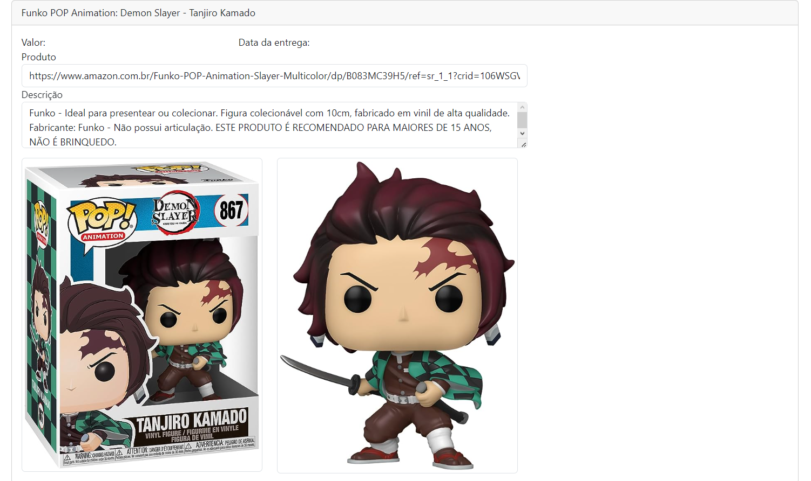
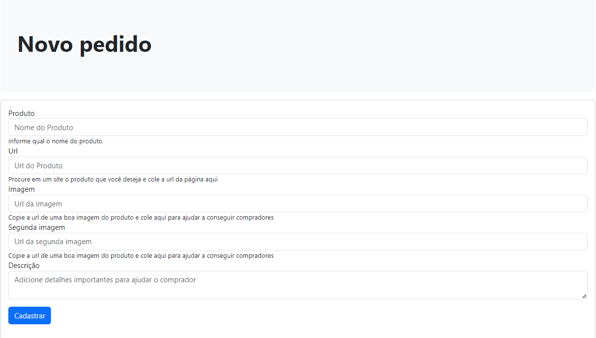

# Funko Shop

## 📝 Projeto
- Projeto desenvolvido na aula de Digital Business Enablement onde foi construída uma Api Rest de um sistema de leilão reverso, onde o usuário poderá dar lances por produtos e visualizar os produtos disponíveis.

## ✔️ Técnicas e tecnologias utilizadas

- ``Spring Boot 3.1.2``
- ``Spring MVC``
- ``Java 17``
- ``Maven``
- ``Thymeleaf``
- ``Bootstrap``
- ``HTML``
- ``MariaDB``
- ``Bean Validation``
## Atenção
- ``É necessário a criação de uma tabela no MariaDB com o nome "funkoshop"``

  

  

